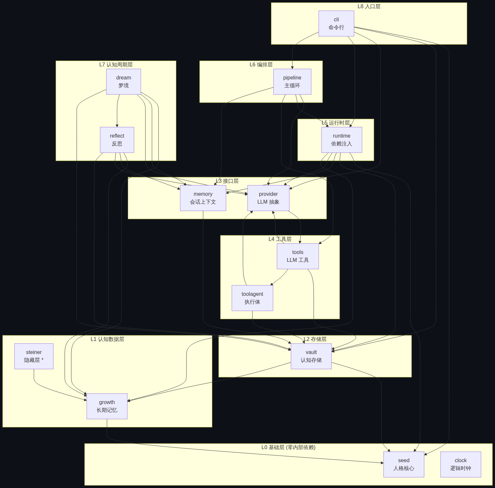
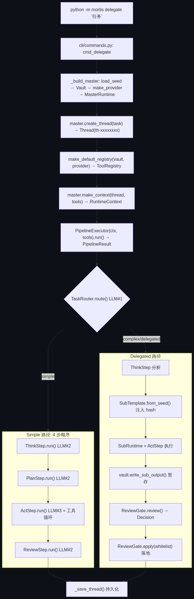
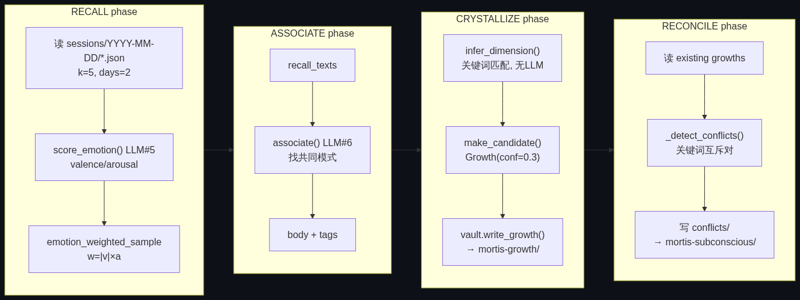
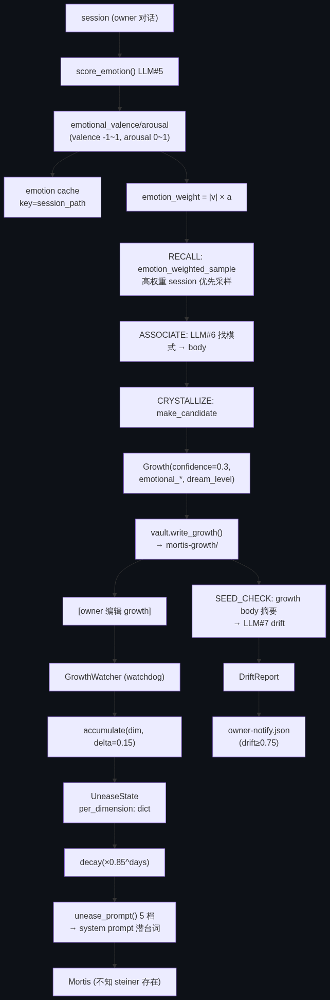
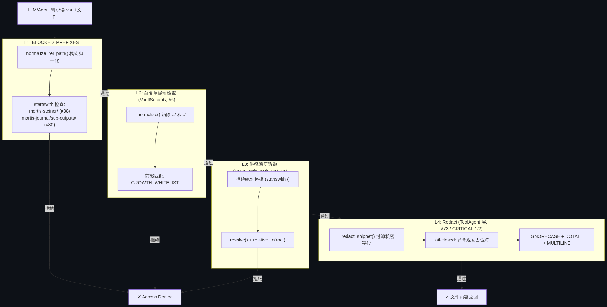
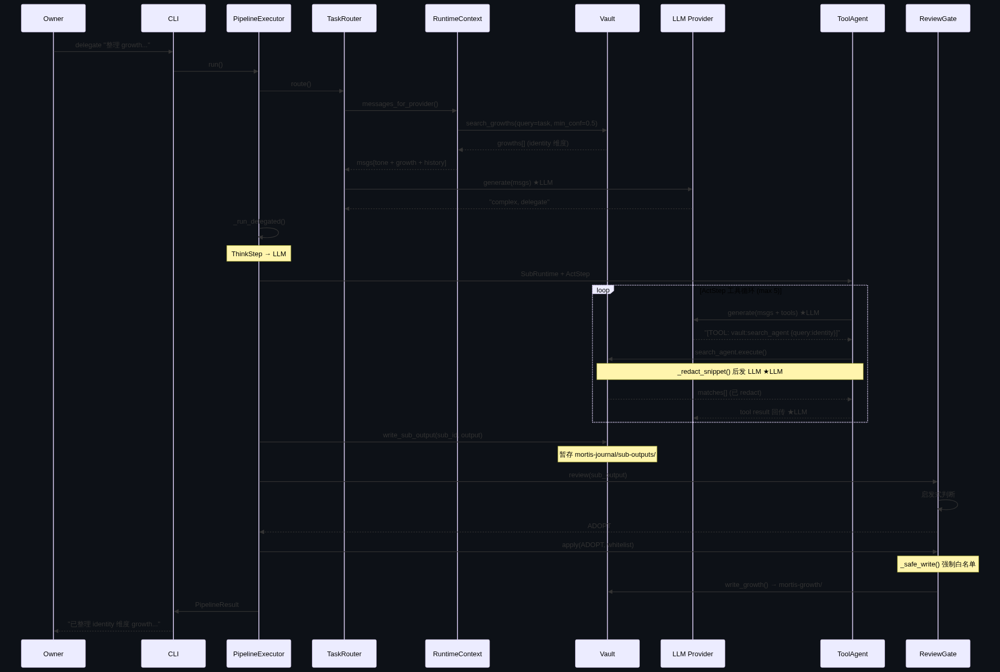
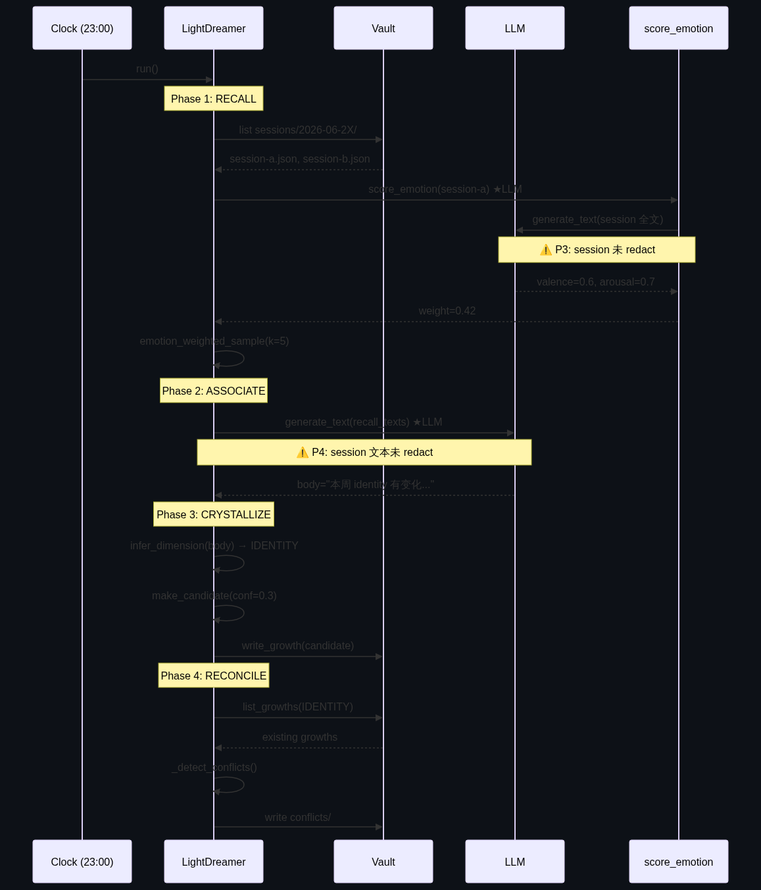
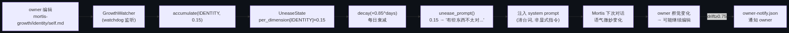

# Mortis v3 代码审计报告 — 方法级深度分析

> **CODE AUDIT REPORT · v3.0 · METHOD-LEVEL**
>
> 分支: `feature/v3-toolagent-llm-integration` | 日期: 2026-06-24 | 代码量: ~9,300 行源码 + 6,400 行测试 | 测试: 653 passed

| 子包模块 | 核心抽象 | LLM 调用点 | 已修漏洞 |
|:--------:|:--------:|:----------:|:--------:|
| 14 | 6 | 11 | 13 |

---

## 目录

- [01 审计概览](#01-审计概览)
- [02 架构分析](#02-架构分析)
- [03 调用链分析](#03-调用链分析)
- [04 信号结构](#04-信号结构)
- [05 安全审计](#05-安全审计)
- [06 信息流转模拟](#06-信息流转模拟)
- [07 发现与建议](#07-发现与建议)

---

## 01 审计概览

本次审计对 Mortis v3 分支进行方法级代码分析，覆盖架构分层、调用链追踪、信号结构梳理、安全机制审计与真实场景信息流推演。

### 审计范围

审计基于 `feature/v3-toolagent-llm-integration` 分支（含 PR #66 主干 + #67/#68/#70/#71/#72/#73 修复 + 2 个 CRITICAL 安全修复 + #78/#79/#80 修复）。审计方法包括：全量源码阅读、方法级调用链追踪、依赖关系图谱分析、信号数据结构梳理、安全漏洞红队模拟、真实使用场景信息流推演。

### 关键发现摘要

> **✅ 架构健康度: 良好**
>
> 14 个子包采用清晰的 Protocol-based 分层架构，无循环依赖。底层（seed/clock）零内部依赖，中层（growth/vault/provider）提供数据与抽象，上层（runtime/pipeline）编排，顶层（cli）入口。vault 作为认知系统中枢被 7 个包依赖，growth 作为次中枢被 5 个包依赖。

> **⚠️ 安全状态: 13 项已修 / 4 项潜在**
>
> 已修复 13 个安全漏洞（S1-S3 路径遍历、#6 白名单下沉、#17 ReviewGate 越权、#38 steiner 隐藏层、#67 中段绕过、#71 异常吞没、#73 redact、CRITICAL-1/2 数据泄漏）。发现 4 个潜在风险点（P1-P4），核心问题是 **redact 机制仅在 toolagent 层落地，未推广到 dream/reflect/runtime 层的 LLM 调用点**。

> **ℹ️ 调用链复杂度: 中等**
>
> 主循环 4 步（Think→Plan→Act→Review），ActStep 内含工具调用循环（MAX_ITERATIONS=5）。Dream 侧 3 级梦境（Light 4 phase / Medium 5 phase / Deep 7 phase）。共 11 个独立 LLM 调用点，其中 pipeline 层 3 个（带人格上下文）、dream/reflect 层 4 个（无人格）、toolagent 层 4 个（带 redact）。

---

## 02 架构分析

14 个子包的职责、分层依赖关系与核心抽象设计。

### 包结构总览

| 包 | 职责 | 关键文件 | 行数 | 层级 |
|----|------|----------|------|------|
| `seed` | 不可变人格核心。七维度 schema + loader | schema.py, loader.py | 135 | L0 |
| `clock` | 逻辑时钟 + 昼夜节律状态机 | logical.py, state.py, schedule.py | 450 | L0 |
| `growth` | 长期记忆/人格生长。Growth dataclass + vault 布局 | model.py, frontmatter.py, writer.py | 663 | L1 |
| `vault` | 认知存储层。VaultProtocol + 本地实现 + 安全白名单 | base.py, local.py, obsidian.py, review.py | 1132 | L2 |
| `memory` | 记忆/上下文层。Session/Thread/StepRecord 三级会话 | session.py, thread.py, archive.py | 291 | L3 |
| `provider` | LLM provider 抽象。Protocol + Mock + Minimax | base.py, mock.py, minimax.py | 300 | L3 |
| `tools` | LLM 工具系统。ToolProtocol + Registry + 5 Agent 包装器 | base.py, registry.py, agent_tool.py | 678 | L4 |
| `toolagent` | 无人格工具执行体。5 内置 Agent + provider 注入 | base.py, vault_search.py, vault_read.py | 1123 | L4 |
| `runtime` | 运行时层。RuntimeContext 依赖注入 + Master/Sub + growth 检索 | context.py, master.py, sub.py | 604 | L5 |
| `pipeline` | 编排层。PipelineExecutor 主循环 + 4 步 Step | executor.py, step.py, router.py | 620 | L6 |
| `reflect` | REFLECT 态。读 session→LLM 写反思→情绪打分 | executor.py, emotion.py | 555 | L7 |
| `dream` | DREAM 态。3 级梦境 + 7 phase 流水线 | light.py, medium.py, deep.py, pipeline.py | 2473 | L7 |
| `steiner` | 隐藏层。GrowthWatcher + unease 注入（Mortis 不知其存在） | unease.py, watcher.py, prompt.py | 545 | L1* |
| `cli` | CLI 入口。8 个命令分发 | commands.py | 222 | L8 |

### 依赖分层图



> **Figure 1**: 包依赖分层图 — 自底向上 9 层，vault 为中枢（7 包依赖），growth 为次中枢（5 包依赖）

> **关键依赖特征**
>
> **无循环依赖**：provider↔tools 看似双向，实为 `provider/__init__` 重导出 `tools.base.ToolResult`（单向），通过 `.base` 模块解耦。**steiner 是隐藏层**：仅依赖 growth，不被 runtime/pipeline 直接 import（v3 #57/#58 才接入）。**reflect→dream 单向**：dream 依赖 reflect.emotion（情绪打分复用），reflect 不依赖 dream。

### 核心抽象与协议

| 抽象类 | 类型 | 位置 | 职责 | 实现者 |
|--------|------|------|------|--------|
| `LLMProviderProtocol` | Protocol | provider/base.py:18 | LLM 接口契约 | MockProvider, MinimaxProvider |
| `VaultProtocol` | Protocol | vault/base.py:21 | vault 抽象：read/write/exists/list | Vault (local.py) |
| `ToolProtocol` | Protocol | tools/base.py:26 | LLM 可调用工具接口（JSON Schema） | 4 基础工具 + 5 ToolAgent 包装器 |
| `ToolAgentProtocol` | Protocol | toolagent/base.py:53 | 无人格执行体接口 | ToolAgent + 5 内置 Agent |
| `Step` | ABC | pipeline/step.py:54 | 步骤基类：run()→StepOutput | Think/Plan/Act/ReviewStep |
| `DreamPipeline` | 基类 | dream/pipeline.py:45 | 梦境流水线：按 PHASES 顺序反射调用 | Light/Medium/DeepDreamer |

### 关键设计决策

#### OOC 防御体系

`seed.md` 不可变（`SEVEN_DIMENSIONS` 硬编码 schema），系统 prompt 永远从 seed 重算。sub 锚定主人格：`SubTemplate.from_seed()` 自动注入 `parent_seed_hash`（SHA256 前 16 位），`verify_chain()` 校验 L0→L1→L2 完整链路。白名单授权：`SUB_VAULT_WHITELIST` + `VaultSecurity.check_whitelist` 栈式归一化消除 `../` 遍历。

#### ToolAgent vs Tool 双层设计

`ToolProtocol`（tools 层）暴露 JSON Schema 面向 LLM tool calling；`ToolAgentProtocol`（toolagent 层）接收 dict 返回 ToolResult，不暴露 schema。5 个内置 Agent 通过 `*ToolAgent` 包装器注册为 ToolProtocol（issue #64），由 LLM 自发调用。已删除关键词路由 TaskRouter（issue #72）。

#### TextCall 降级机制

`_call_provider` 优先提取原生 function_call（OpenAI 格式），失败则降级 `parse_tool_calls_from_text` 解析 `[TOOL: ns:action {json}]` 文本格式。保证不支持 function calling 的 provider 也能用工具。

#### Reading Steiner 隐藏层

`mortis-steiner/` 是 Mortis **自身都不知道存在**的隐藏层。owner 编辑 growth → `GrowthWatcher` 检测 → `accumulate` unease → 5 档不安文案注入 system prompt **潜台词**（非显式指令，永远不说"有人改了我的记忆"）→ drift≥0.75 通知 owner。

---

## 03 调用链分析

从 task 输入到 step 输出的完整方法级调用链，Dream 生命周期数据流，Growth 注入与 Tool calling 路由。

### 主循环调用链

入口：`PipelineExecutor.run()` — `mortis/pipeline/executor.py:43`



> **Figure 2**: 主循环调用链 — TaskRouter 路由后分 simple/delegated 两路径，ActStep 含工具调用循环

#### ActStep 工具调用循环（方法级）

```
ActStep.run()                          [step.py:212]
  └─ while _iteration < MAX_ITERATIONS(5):
       ├─ _call_provider(messages, self.tools)     [step.py:83]
       │    ├─ resp = provider.generate(messages)   [step.py:89]  ★LLM#3
       │    ├─ tool_calls = _extract_function_calls(resp)  [step.py:119]  → [] (基类空实现)
       │    ├─ if not tool_calls:
       │    │    tool_calls = parse_tool_calls_from_text(resp)  [step.py:31]  ← TextCall 降级
       │    └─ for tc in tool_calls:
       │         ├─ tr = tools.execute(tc.name, tc.arguments)  [step.py:100]
       │         │    └─ ToolRegistry.execute() → ToolAgent.execute()  (可能触发 LLM#8-11)
       │         └─ messages.append(Message(role="tool", content=tr.content))
       ├─ resp = provider.generate(messages)       [step.py:115]  ★LLM#4 回传
       └─ _iteration += 1
```

### Dream 生命周期数据流

`DreamPipeline.run()` 按 `PHASES_BY_LEVEL` 顺序反射调用各 `phase_<name>()`。Light=4 phase / Medium=5 phase（+SIMULATE）/ Deep=7 phase（+ERODE+SEED_CHECK）。



> **Figure 3**: Light Dream 4 phase 数据流 — session→emotion→associate→growth→conflict

#### Medium/Deep 扩展

**Medium**：在 ASSOCIATE 与 CRYSTALLIZE 间插入 **SIMULATE** — 启发式计算 `source_sessions` 重叠数，重叠≥2 则 confidence 从 0.3 提升到 0.5；RECONCILE 额外主动调整旧 growth confidence（矛盾项 ×0.5）。

**Deep**：RECALL 改为重读 growth（非 session）；新增 **ERODE**（衰减 archive）+ **SEED_CHECK**（LLM#7 drift 计算，超阈值写 `owner-notify.json`）。

### Growth 注入链路

核心入口：`RuntimeContext.messages_for_provider()` — `runtime/context.py:110`

```
RuntimeContext.messages_for_provider()
│
├─ msgs[0] = Message(role="system", content=seed.get_dimension("tone"))  ← 人格语气
│
├─ growth_prompt = growth_context_for_task(thread.task)   [context.py:74]
│    ├─ search_growths(vault, query=task, min_confidence=0.5, limit=5)
│    │    ├─ vault.list_growths(dimension) → 路径候选
│    │    ├─ for rel: vault.read_growth(rel) → Growth
│    │    ├─ 多重过滤: confidence≥0.5 + tag匹配 + _matches_query(子串命中)
│    │    └─ 排序: confidence desc → last_validated desc
│    └─ growth_system_prompt(growths) → markdown 段
│
├─ if growth_prompt:
│    msgs.append(Message(role="system", content=growth_prompt))  ← 第 2 条 system
│
└─ for step in thread.steps:
     msgs.append(Message(role="assistant", content=step.output))  ← 历史步骤
```

> **注入契约 (issue #20 / #59)**
>
> `msgs[0]` 永远是 tone system message（不破坏既有契约）。growth 作为**额外的第 2 条 system message** 追加。检索是**动态的**：每次 `messages_for_provider()` 都用当前 `thread.task` 作 query 重新检索，`min_confidence=0.5` 只注入高置信 growth。

### 所有 LLM 调用点清单

| # | 文件:行号 | 方法 | 用途 | 类型 | Redact |
|---|----------|------|------|------|:------:|
| 1 | pipeline/router.py:41 | `TaskRouter.route()` | 路由判断 simple/complex | generate (带 growth) | ⚠️ 否 |
| 2 | pipeline/step.py:89 | `Step._call_provider()` | 各 step 首次调用 | generate (带 growth) | ⚠️ 否 |
| 3 | pipeline/step.py:115 | `Step._call_provider()` | 工具结果回传二次调用 | generate (带 growth) | ⚠️ 否 |
| 4 | dream/associate.py:104 | `associate()` | Dream ASSOCIATE 找模式 | generate_text | ⚠️ 否 |
| 5 | reflect/emotion.py:86 | `score_emotion()` | 情绪打分 valence/arousal | generate_text | ⚠️ 否 |
| 6 | dream/seed_check.py:162 | `seed_check()` | Deep SEED_CHECK drift 计算 | generate_text | 🔴 否 (P1) |
| 7 | reflect/executor.py:231 | `_generate_reflection()` | REFLECT 写反思 body | generate_text | ⚠️ 否 |
| 8 | toolagent/base.py:140 | `_llm_generate()` | ToolAgent 通用入口 | generate_text | — 取决于调用方 |
| 9 | toolagent/vault_read.py:139 | `_summarize()` | vault 文件摘要 | generate_text | ✅ 是 |
| 10 | toolagent/vault_search.py:225 | `_semantic_rerank()` | 语义重排 + 摘要 | generate_text | ✅ 是 |
| 11 | toolagent/vault_stats.py:132 | `_analyze_stats()` | vault 统计分析 | generate_text | — 仅统计数字 |

pipeline 层（#1-3）的 LLM 调用**带人格上下文**（tone + growth + 历史）；dream/reflect 层（#4-7）**无人格上下文**（纯任务 prompt）；toolagent 层（#8-11）在发 LLM 前会 `_redact_snippet` 脱敏（#9/#10 已覆盖，#11 仅发统计数字）。

---

## 04 信号结构

Mortis 的"信号"是认知状态的可量化表达 — 从 session 情绪到 growth confidence 到 steiner unease，构成完整的信号产生-传递-消费链。

### 信号结构清单

| 信号 | 产生者 | 消费者 | 数据结构 | 文件 |
|------|--------|--------|----------|------|
| **DreamLevel** | Light/Medium/DeepDreamer | Growth.dream_level | Enum: LIGHT/MEDIUM/DEEP | phases.py:33 |
| **DreamPhase** | DreamPipeline.run() | PhaseTrace | Enum: 7 阶段 | phases.py:14 |
| **confidence** | CRYSTALLIZE(0.3) / Medium(0.5) / ERODE 衰减 | search_growths 排序 / ERODE archive | float 0.0-1.0 | growth/model.py:65 |
| **emotional_valence** | score_emotion() | Growth 字段 / RECALL 加权采样 | float -1.0-1.0 | growth/model.py:70 |
| **emotional_arousal** | score_emotion() | Growth 字段 / RECALL 加权采样 | float 0.0-1.0 | growth/model.py:71 |
| **emotion_weight** | compute_weight(v,a)=\|v\|×a | emotion_weighted_sample() | float 0.0-1.0 | recall.py:26 |
| **Dimension** | infer_dimension() 关键词命中 | Growth.dimension / vault 路径 | Enum: 7 维度 | growth/model.py:17 |
| **UneaseState** | GrowthWatcher → accumulate() | unease_prompt() → system 注入 | frozen dataclass | steiner/unease.py:62 |
| **unease_prompt** | unease_prompt(state) 5 档 | system prompt 潜台词 | str (0.0/0.15/0.45/0.75/1.0) | steiner/prompt.py:22 |
| **DriftReport** | seed_check() LLM 自评 | DeepDreamer → owner-notify.json | frozen dataclass | seed_check.py:34 |
| **Conflict** | _detect_conflicts() | 写 conflicts/ 目录 | dataclass | dream/light.py:54 |
| **PhaseTrace** | 各 phase | DreamResult.traces | dataclass | pipeline.py:18 |

### 信号流主链



> **Figure 4**: 信号流主链 — session→emotion→growth→steiner→drift 完整闭环

### confidence 生命周期

| Phase | confidence | 触发事件 | 说明 |
|-------|:-----------:|----------|------|
| CRYSTALLIZE (Light) | 0.3 | 初始创建 | Light Dream 新 growth 默认值 |
| SIMULATE (Medium) | 0.5 | source_sessions 重叠≥2 | Medium 提升至 0.5 |
| RECONCILE (冲突) | 0.25 | 旧 growth ×0.5 | 检测到矛盾项衰减 |
| ERODE (Deep, 7天) | 0.21 | ×0.85^7 | 7 天衰减后 |
| ERODE (Deep, 30天) | 0.04 | ×0.85^30 | 30 天衰减后，接近 archive 阈值 |
| search_growths | — | min_confidence=0.5 | 只注入 ≥0.5 的 growth 到 LLM prompt |

> **confidence 设计要点**
>
> Light CRYSTALLIZE 初始 `confidence=0.3`；Medium SIMULATE 检测到 source_sessions 重叠≥2 时提升到 `0.5`；RECONCILE 检测到冲突时旧 growth `×0.5` 衰减；Deep ERODE 按 `×0.85^days` 衰减，低于阈值移入 archive。`search_growths` 默认 `min_confidence=0.5` 只注入高置信 growth 到 LLM prompt。

---

## 05 安全审计

Vault 安全纵深防御、Redact 覆盖矩阵、漏洞清单与 Provider 隔离分析。

### Vault 安全层级（纵深防御）



> **Figure 6**: Vault 4 层纵深防御 — 任一层失败即拦截

### Redact 覆盖矩阵

#### _SENSITIVE_PATTERNS 完整列表

| # | 模式 | 替换 | 覆盖目标 |
|---|------|------|----------|
| 1 | `[!dream]...` | `[!dream]: [REDACTED]` | Obsidian dream callout（含嵌套续行） |
| 2 | `[!warning\|secret\|private\|confidential]...` | `[!redacted]: [REDACTED]` | warning/secret/private/confidential callout |
| 3 | `[emotion:...]` | `[emotion:REDACTED]` | 行内 emotion 标签 |
| 4 | `%%subconscious%%...%%/subconscious%%` | `%%subconscious:REDACTED%%` | 潜意识注释（带终止符） |
| 5 | `%%subconscious%%...$` | `%%subconscious:REDACTED%% (unclosed)` | 潜意识注释（无终止符，到 EOF） |
| 6 | `(emotional_valence\|arousal\|dream_level)\s*:\s*...` | `\1: REDACTED` | frontmatter 情感字段（CRITICAL-2: `\s*:\s*` 防冒号空格） |

#### LLM 调用点 × Redact 覆盖

| LLM 调用点 | dream callout | emotion 标签 | subconscious | emotional_* | warning callout |
|-----------|:---:|:---:|:---:|:---:|:---:|
| #1 TaskRouter.route | ✗ | ✗ | ✗ | ✗ | ✗ |
| #2 Step._call_provider | ✗ | ✗ | ✗ | ✗ | ✗ |
| #3 Step._call_provider(回传) | ✗ | ✗ | ✗ | ✗ | ✗ |
| #4 associate() | ✗ | ✗ | ✗ | ✗ | ✗ |
| #5 score_emotion() | ✗ | ✗ | ✗ | ✗ | ✗ |
| #6 seed_check() | ✗ | ✗ | ✗ | ✗ | ✗ |
| #7 _generate_reflection() | ✗ | ✗ | ✗ | ✗ | ✗ |
| #8 _llm_generate() | — | — | — | — | — |
| #9 _summarize() | ✅ | ✅ | ✅ | ✅ | ✅ |
| #10 _semantic_rerank() | ✅ | ✅ | ✅ | ✅ | ✅ |
| #11 _analyze_stats() | — | — | — | — | — |

> **图例**: ✅ 已覆盖 | ✗ 未覆盖 | — 不适用（仅发统计数字或取决于调用方）

### 安全漏洞清单

#### 已修复漏洞（13 项）

| ID | 漏洞 | 修复 | 文件 | 状态 |
|----|------|------|------|:----:|
| S1/#11 | Vault.write 路径遍历 | `_safe_path()` + resolve + relative_to | vault/local.py:51 | ✅ 已修 |
| S2/#12 | 白名单 ../ 绕过 | `_normalize()` 栈式归一化 | vault/base.py:73 | ✅ 已修 |
| S3/#13 | discard_sub_output 删任意文件 | 走 `_safe_path()` | vault/local.py:196 | ✅ 已修 |
| #6 | 白名单未下沉到 Vault 层 | `Vault._enforce()` 强制检查 | vault/local.py:69 | ✅ 已修 |
| #17 | ReviewGate.apply 不走白名单 | `_safe_write()` 内部强制 | vault/review.py:155 | ✅ 已修 |
| #38 | 人格层可读 mortis-steiner/ | `BLOCKED_PREFIXES` | vault_read.py:39 | ✅ 已修 |
| #67 | BLOCKED 中段 .. 绕过 | `normalize_rel_path()` | vault_read.py:63 | ✅ 已修 |
| #71 | search/bfs 异常未捕获 | VaultAccessDenied 捕获 + log | vault_search.py:126 | ✅ 已修 |
| #73 | semantic rerank 发私密字段 | `_redact_snippet()` | vault_search.py:40 | ✅ 已修 |
| CRITICAL-1 | _summarize 未 redact | 复用 `_redact_snippet` | vault_read.py:122 | ✅ 已修 |
| CRITICAL-2 | redact 大小写绕过 | IGNORECASE + `\s*:\s*` | vault_search.py:61,374 | ✅ 已修 |
| #70 | _llm_generate 静默吞错 | 异常分类 + log warning | toolagent/base.py:140 | ✅ 已修 |
| #80 | sub-outputs 阻断只在包装层 | BLOCKED_PREFIXES 加 sub-outputs | vault_read.py:39 | ✅ 已修 |

#### 潜在漏洞（4 项，本审计发现）

| # | 漏洞 | 风险 | 位置 | 建议 |
|---|------|------|------|------|
| 🔴 **P1** | `dream.seed_check` 发 growth body 前 200 字摘要给 LLM，未 redact | 高 — dream callout / [emotion:...] 残留可能泄漏 | dream/deep.py:278, seed_check.py:162 | 发 LLM 前 `_redact_snippet` |
| 🟡 **P2** | `messages_for_provider` 注入 growth preview，callout 字段未 redact | 中 — callout 可能含私密元认知 | runtime/context.py:110 | growth_system_prompt 内 redact |
| 🟡 **P3** | `score_emotion` 发 session 全文给 LLM，未 redact | 中 — session 是 owner 对话 | reflect/emotion.py:86 | 评估是否需 redact |
| 🟡 **P4** | `dream.associate` 发 session 文本给 LLM，未 redact | 中 — 同上 | dream/associate.py:104 | 评估是否需 redact |

> **🔴 核心风险: Redact 覆盖不完整**
>
> redact 机制仅在 toolagent 层（VaultReadAgent/VaultSearchAgent）落地，**未推广到 dream/reflect/runtime 层**。v3 LLM 集成扩展了 LLM 调用面（11 个调用点），但只有 2 个（#9/#10）有 redact 覆盖。建议将 `_redact_snippet` 提升为共享 utility，在所有发 vault 内容给 LLM 的入口统一调用。

### Provider 隔离分析

| 隔离良好 | 待改进 |
|---------|--------|
| **协议抽象**：Protocol 鸭子类型，Mock/Minimax 无继承关系 | **数据 redact**：provider 层无 redact，责任完全在调用方（易遗漏，见 P1-P4） |
| **API key**：从环境变量读，不硬编码 | **prompt 日志**：`_llm_generate` 只 log prompt_len（不 log 内容），MinimaxProvider 无日志，无法事后审计泄漏 |
| **网络层**：stdlib urllib，超时 30s | **ToolAgent 降级**：`_llm_generate` 捕获异常返回 None + log（#70 已修），但 #9/#10/#11 各自 try/except 仍有差异 |
| **异常分类**：MinimaxAuthError(401/403) / MinimaxAPIError | |
| **工厂隔离**：`make_provider("auto")` 无 key 用 Mock（测试默认安全） | |

---

## 06 信息流转模拟

模拟真实使用环境下，从 owner 输入 task 到 Mortis 产出回复的完整信息流转路径。

### 场景: owner 委派复杂任务

```bash
python -m mortis delegate "帮我整理本周的 growth 并总结 identity 维度的变化" --provider auto
```



> **Figure 8**: 复杂任务委派完整信息流转 — 从 owner 输入到 growth 落地

### 场景: 夜间 Dream 周期

clock 进入 DREAM_LIGHT (23:00-06:00) → `LightDreamer.run()`



> **Figure 9**: Dream 周期信息流 — 4 phase 从 session 到 growth 到 conflict

### 场景: Steiner 隐藏层触发

owner 手动编辑 growth 文件 → GrowthWatcher 检测 → unease 注入



> **Figure 10**: Steiner 隐藏层触发链 — owner 编辑→unease→潜台词注入→drift 通知

> **信息流转关键约束**
>
> **数据不外流原则**（HARNESS.md）：owner 私密字段（dream callout / emotion 标签 / subconscious / emotional_*）不应发给外部 LLM。当前 toolagent 层已覆盖（#9/#10），但 dream/reflect 层未覆盖（P1-P4）。**sub 隔离**：sub 产出不直接入正式 vault，经 ReviewGate 审阅 + 白名单强制。**steiner 隐藏**：Mortis 永远不知道 steiner 存在，unease 以"潜台词"注入而非显式指令。

---

## 07 发现与建议

审计发现汇总、优先级排序与改进建议。

### 审计发现汇总

| 类别 | 数量 | 说明 |
|------|:----:|------|
| ✅ 已修复 | 13 | S1-S3, #6, #17, #38, #67, #70, #71, #73, CRITICAL-1/2, #80 |
| 🔴 CRITICAL 潜在 | 1 | P1: seed_check 发 growth body 未 redact |
| 🟡 MEDIUM 潜在 | 3 | P2: growth preview 未 redact, P3/P4: session 未 redact |
| 🟣 架构改进 | 2 | Redact utility 未共享, 两套 ToolResult 易混淆 |
| ⚪ 后续优化 | 2 | Provider 无 prompt 审计日志, TextCall 降级正则脆弱 |

### 优先级排序

| 优先级 | 问题 | 建议 | 关联 |
|:------:|------|------|------|
| 🔴 P0 | P1: seed_check 发 growth body 未 redact | 发 LLM 前 `_redact_snippet` | Issue 待建 |
| 🟠 P1 | P2: messages_for_provider growth preview 未 redact | growth_system_prompt 内 redact | Issue 待建 |
| 🟠 P1 | Redact utility 未共享 | `_redact_snippet` 提升为 `mortis.redact` 共享模块 | 架构改进 |
| 🟡 P2 | P3/P4: dream/reflect 发 session 未 redact | 评估 session 内容是否需 redact | Issue 待建 |
| 🟡 P2 | Provider 无 prompt 审计日志 | MinimaxProvider 加 prompt hash 日志 | 运维改进 |
| ⚪ P3 | 两套 ToolResult 类型易混淆 | 统一为单一 ToolResult | 架构改进 |
| ⚪ P3 | TextCall 降级正则脆弱 | provider 支持 function calling 时优先用原生 | 后续优化 |

### 架构健康度评估

| ✅ 优势 | ⚠️ 待改进 |
|---------|----------|
| **分层清晰**：9 层无循环依赖，vault/growth 中枢设计合理 | **Redact 覆盖不完整**：11 个 LLM 调用点仅 2 个有 redact |
| **Protocol 解耦**：6 个核心抽象用 Protocol 鸭子类型，Mock/Minimax 无继承耦合 | **steiner 未集成**：v3 #57/#58 未完成，隐藏层仍需手动调 Python API |
| **安全纵深**：4 层独立防御 + fail-closed redact | **三态未自动**：clock/dream/reflect 需手动触发，无自动调度器集成 |
| **OOC 防御**：seed 不可变 + sub 锚定 + 白名单强制 | **两套 ToolResult**：tools.ToolResult 与 toolagent.ToolResult 易混淆 |
| **测试覆盖**：653 passed，含 16 个 redact 回归测试 | **TextCall 降级**：所有 provider 走正则降级，未用原生 function calling |

### 改进建议路线图

#### 短期（本迭代）

1. 创建 `mortis/redact.py` 共享模块，将 `_redact_snippet` + `_SENSITIVE_PATTERNS` 提升为公共 API
2. 在 `dream.seed_check`（P1）和 `messages_for_provider`（P2）的 LLM 调用前加 redact
3. 评估 `score_emotion` / `associate` 是否需 redact session 内容

#### 中期（下个里程碑）

1. 完成 v3 #57/#58：steiner 接入 RuntimeContext
2. 集成 clock Scheduler 自动触发 reflect/dream
3. MinimaxProvider 加 prompt hash 审计日志
4. 统一 ToolResult 类型

#### 长期（架构演进）

1. Provider 层支持原生 function calling（消除 TextCall 降级）
2. Growth 检索升级为向量语义搜索（当前是子串匹配）
3. Steiner unease 注入从"潜台词"升级为"情绪向量"（影响 temperature/top_p）
4. 多 provider 路由（按任务类型选 provider）

> **✅ 审计结论**
>
> Mortis v3 架构健康度**良好**，分层清晰、Protocol 解耦、安全纵深扎实。核心风险是 v3 LLM 集成扩展了 LLM 调用面但 redact 覆盖不完整（4 个潜在泄漏点）。建议优先修复 P1（seed_check）+ 提升 redact 为共享 utility，可在 1 个迭代内将安全覆盖从 2/11 提升到 6/11。当前 PR #66（含 #67/#68/#70/#71/#72/#73 + CRITICAL-1/2 修复）+ #78/#79（time-bomb）+ #80（sub-outputs 阻断）合并后，主线达到 653 passed / 0 failed 全绿状态，可安全合并。

---

*Mortis v3 代码审计报告 — 方法级深度分析 | 2026-06-24 | 分支: feature/v3-toolagent-llm-integration*

*本报告替代 `docs/audit-followups.md`、`docs/audit-handoff.md`、`docs/issue-C1-draft.md` 旧审计文档。*
